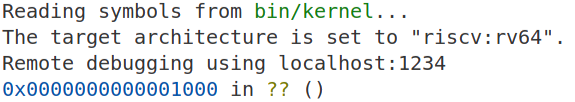
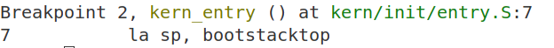

# Lab1-最小可执行内核
## 练习一
在操作系统的内核启动流程中，Qemu会先在芯片硬件设计的初始复位地址执行写死的固定指令，完成基础的环境准备，接着会将控制权移交给OpenSBI。OpenSBI就是RISC-V架构下的“BIOS类似物”（皆可称为boot loader），它会将我们内核镜像文件加载到固定的位置，当PC走到这个位置时，CPU的控制权自然而然就从OpenSBI转移到了我们的OS内核了。但这个过程中，由于操作系统的复杂性要远大于前面的“控制者”，所以这个控制权转移的过程也不简单。在本练习中，我们将分析代码文件`kern/init/entry.S` 是如何引导系统进入内核环境的。

### 1. `la sp, bootstacktop`
首先，la sp, bootstacktop 这条指令将内核栈的顶部地址（即bootstacktop）加载到栈指针寄存器 sp 中。栈指针 sp 是操作系统中管理栈的关键寄存器，指示当前栈的位置。内核栈 bootstack 在内核启动时会被初始化并设置在内存中的一块特定区域，通常是从高地址向低地址增长。通过这条指令，内核确保栈指针指向栈的顶部，为后续内核执行提供了必要的栈空间。

### 2. `tail kern_init`
接着，tail kern_init 指令的作用是将程序的控制权交给内核初始化函数 kern_init，并确保执行完该函数后不会返回。tail 是一种优化指令，能够减少栈帧的创建和销毁，提升程序的效率。在内核启动过程中，kern_init 函数负责执行内核的初始化任务，包括初始化内核数据结构、硬件设置以及其他关键组件。通过使用 tail 指令，内核保证了启动过程的流畅性，且不再回到之前的代码，确保了内核初始化的顺利进行。
## 练习2
我们使用tmux打开终端复用会话，这样我们就可以开启两个窗口，一边运行QEMU，一边运行GDB。

使用 `Ctrl+B+%` 垂直分割两个窗格，左边输入 `make debug`，在配置中已经加入了`-S`选项，让虚拟CPU一启动就立刻暂停，同时加入了`-s`选项，意为打开1234端口，为我们启动GDB调试作准备。

在右侧窗格输入`make gdb`后，我们发现这其实是`riscv64-unknown-elf-gdb`执行了多个操作：
1. `file bin/kernel`：加载编译好的内核文件
1. `set arch riscv:rv64`：调试的是 **RISC-V 64位**的程序
2. `target remote localhost:1234`：去连接本机（localhost）的1234端口，QEMU也在此等待。

进入调试后，先执行了程序第一条指令：

我们看到程序从CPU复位地址`0x1000`开始执行初始化固件（OpenSBI）的汇编代码，进行最基础的硬件初始化。后续我们继续键入`si`进行单步执行，地址每次递增4,在5条指令过后，地址跳转到了`0x80000000`，在此之前的指令是MROM的固件代码，完成最基本的环境准备，然后 **OpenSBI** 被加载到了`0x80000000`处。
根据实验指导中的提示，为了避免单步调试效率低的问题，我们可以用`watch *0x80200000`命令，这样可以直接观察内核加载，相当于设置了观察点，如果这个点的内容被修改，我们会获得反馈。我们要做的就是执行到这个观察点，直接键入`c`，就可以让程序向下执行，直到执行到了观察点并且修改了这个地址的内容。但这只是美好的愿望，实际上我们并没有观察到相关的输出，在刚进入调试时我们就通过输入命令`x/i 0x80200000`查看此时该地址的指令，得到如下输出：

`0x80200000 <kern_entry>:     auipc   sp,0x3`

也就是说，内核已经被加载了，关于这个问题，我在问题统计问卷中向助教询问，助教给出的解答是 **本质上是qemu的机制，在执行makedebug的时候，qemu就已经扮演了一个"超级预加载器"的角色，直接将内核文件加载到了相应的位置**，所以说，只有在理论上刚刚开始时存在没有被加载的情况，而我们很难定位到这个时刻。
下一步我们可以在`0x80200000`处设置断点，即执行到此处会停止，命令为`b *0x80200000`，输入`continue`后，得到输出：

此时内核暂停在入口函数的第一条汇编指令处，我们可以接着单步执行，观察代码的执行过程：
1. 两步之后，执行到指令`tail kern_init`，它是RISC-V 的尾调用指令，这里用于从 kern_entry 跳转到 kern_init 函数
2. 接着在init过程中执行memset函数，分配.bss数据段
3. 在`0x8020002a`地址处，执行到`cprint`函数
4. 我推测后续执行代码来自于`cprint`函数定义