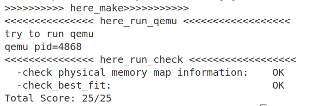

## 练习2
我们需要在`best_fit_pmm.c`中进行代码修改：
### 初始化页框
```c
p ->flags = 0;
p ->property = 0;
set_page_ref(p, 0);
```
我们通过如上代码清空当前页框的标志和属性信息（页块数），调用函数将页框的引用计数设置为0，这一部分与first-fit的做法保持一致。
```c
if (base < page) {
    list_add_before(le, &(base->page_link));
    break;
} else if (list_next(le) == &free_list) {
    list_add(le, &(base->page_link));
}
```
这部分出现在对free_list的循环中，即为该页面寻找一个插入链表的位置，这个位置恰在循环中第一个大于该页面地址的页面之前，如果该页面地址最大，就插在链表结尾。这一部分仍与first-fit的做法保持一致
### Best-Fit
```c
while ((le = list_next(le)) != &free_list) {
        struct Page *p = le2page(le, page_link);
        if (p->property >= n) {
            if(p->property < min_size) {
                page = p;
                min_size = p->property;
            }
        }
    }
```
接下来我们在分配页面的函数中实现best-fit的核心代码，与first-fit不同的是，如果页面大小大于请求的大小，并不是直接将其设置为最终分配的页面并退出循环，而是再加入一个判断，如果其为当前最小的符合要求的页面，那设置为暂时分配的页面并且不退出循环，直到free_list遍历完，当前最小的符合要求的页面才是最终分配的页面。在这其中我们设置了min_size变量，作为“最小”的标准，初始值为总空闲页块数+1，保证一定可以被更新。
### 释放页面
```c
    base->property = n;
    SetPageProperty(base);
    nr_free += n;
```
这一部分仍然与first_fit保持一致，即设置当前页块的属性为释放的页块数、并将当前页块标记为已分配状态、最后增加nr_free的值。
```c
if(p+p->property == base) {
        p->property += base->property;
        ClearPageProperty(base);
        list_del(&(base->page_link));
        base = p;
    }
```
这一部分是实现连续空闲页块，前一个page的地址加上页块大小如果恰好等于该页面地址，那么就说明可以合并，首先是大小向家，然后清除被合并页块的属性标记，也就是不再为空闲，然后从链表里删除该页块，最后把地址更新为前一个空闲页块。
至此我们完成了best-fit的核心代码编写，下面我们在**pmm.c**的代码中修改一行代码：

**pmm_manager = &best_fit_pmm_manager;**

把best-fit方法的指针给pmm_manager，因为两者内存布局相同，所以pmm_manager调用函数时实际上调用的是best-fit的相关方法。
使用**make grade**命令进行测试，结果如下：



我们通过了best-fit的所有测试，说明编写成功！

## Challenge1-buddy system分配算法
### 编程实现
我们在原本代码的基础上新增buddy_pmm模块，按照first-fit的结构进行编写。
我们需要一个新的free list结构，实验指导里推荐二叉树结构，不过我们认为多链表更符合直觉，所以新的空闲区域定义如下：
```c
#define MAX_ORDER 11
typedef struct {
    list_entry_t free_list[MAX_ORDER]; // 每个阶一个链表
    unsigned int nr_free[MAX_ORDER];   // 每个阶的空闲块数
} buddy_free_area_t;
```
我们设定设置11个链表，并且设置数组来记录每个链表的空闲块数，所以最大阶数为10，最大的块大小为1024。
下面进入到buddy system的编写，首先要进行内存初始化，把内存正确分块放到free list中，我在后续的检测中发现了这一部分编写的问题，那就是只注意了按照2的幂次分配，没有进行内存对齐，所以在free阶段，进入free list的块没有找到正确的buddy块，我们最终实现的init_memmap函数如下：
```c
static void
buddy_init_memmap(struct Page *base, size_t n) {
    cprintf("buddy_init_memmap: base %p, n %lu\n", base, n);
    assert(n > 0);

    struct Page *p = base;
    size_t idx = p - pages;  
    size_t left = n;

    while (left > 0) {
        int order = MAX_ORDER - 1;
        while ((1U << order) > left)
            order--;
        while (idx & ((1U << order) - 1))
            order--;

        p->flags = 0;
        p->property = 1U << order;
        set_page_ref(p, 0);
        SetPageProperty(p);
        list_add_before(&free_list[order], &(p->page_link));
        nr_free[order]++;

        p += (1U << order);
        idx += (1U << order);
        left -= (1U << order);
    }
}

```
如果没有内存对齐的要求，我们就从内存地址最小的页开始，用贪心的做法从最大块开始组合，剩余页面不足以组成大块再组成更小的块。但由于要进行内存对齐，所以我们找到剩余页面数量可以组成的最大块的阶数后，还要进行对齐判断，具体做法就是使用页面索引idx（**p - pages**就是当前页面在pages中的索引）和块大小减1进行与运算，因为块大小是2的次幂，所以其二进制只有order位是1,而**1U<< order - 1**可以把order位变为0而低位全为1，这样再与idx进行与运算就可以达到低order位不变、其他位清零的效果，这样就很巧妙地进行了取模，如果余数不为0，那么只能放到更小的块中，直到可以整除块大小。找到合适的阶之后，就对页的属性进行设置，最后把当前页面的指针向后移动，更新当前索引和剩余页面数，进入下一次循环。
接下来开始编写页面分配策略，我们首先需要找到容量大于申请页面数量的块，如果块大小大于等于申请数量的2倍，那么就需要分裂直至小于申请数量的2倍，分裂的过程需要注意以下几点：
1.要先将准备分裂的块从原链表移除
2.分裂块的前半部分取出准备分配或者继续分裂，注意更新其property（这里的property指的是块大小）
3.分裂块的后半部分作为buddy块，放到对应的链表中，注意更新块属性和链表状态
4.最后清除分配块的属性标识，意为不再是空闲块
代码如下：
```c
static struct Page *
buddy_alloc_pages(size_t n) {
    assert(n > 0);
    int order = get_order(n);
    int alloc_order = get_order(n);
    while(order<MAX_ORDER && list_empty(&free_list[order])){
        order++;
    }
    if(order==MAX_ORDER) return NULL; // 没有合适的块

    struct Page *p = le2page(list_next(&free_list[order]), page_link);
    list_del(&(p->page_link));
    nr_free[order]--;

    while(order >alloc_order)
    {
        order--;
        struct Page *buddy = p + (1U << order);
        buddy->property = 1U << order;
        SetPageProperty(buddy);
        list_add(&free_list[order], &(buddy->page_link));
        nr_free[order]++;
        p->property = 1U << order;
        SetPageProperty(p);
    }
    ClearPageProperty(p);
    return p;
}
```
释放分配块的时候要注意按2的幂次大小释放，我们要对相邻的块进行递归合并，具体的做法如下：
1.利用指针相减计算出当前页面的idx
2.idx与块大小进行异或操作，因为block size的除order位外均为0,，所以运算结果除order位以外均不变，order位反转，这就达到了加减**1<<order**的效果。
3.检查buddy块的大小是否与自身一致，并且要确保buddy块空闲
4.删除buddy块，如果buddy块地址更小，更新块地址，order递增，寻求更高层的合并
5.合并结束后设置页块属性，将其加入对应的链表中
代码如下：
```c
static void
buddy_free_pages(struct Page *base, size_t n) {
    assert(n > 0);
    int order = get_order(n);
    struct Page *page = base;
    
    // 递归合并 buddy 块
    while (order < MAX_ORDER-1) {
        size_t block_size = 1U << order;
        size_t idx = page - pages;
        size_t buddy_idx = idx ^ block_size; 
        struct Page *buddy = &pages[buddy_idx];

        // 检查 buddy 是否空闲且同阶
        if (!(PageProperty(buddy) && buddy->property == block_size)) {
            break; // 不能合并，跳出循环
        }
        list_del(&(buddy->page_link));
        nr_free[order]--;
        if (buddy < page) {
            page = buddy;
        }
        order++; 
    }

    page->property = 1U << order;
    SetPageProperty(page);
    set_page_ref(page, 0);
    list_entry_t *le = &free_list[order];
    list_add(le, &(page->page_link));
    nr_free[order]++;
}
```
最后我们实现了一个统计空闲页数的函数，把nr_free数组各项乘上对应块大小再累和即可。
### 验证测试
我们编写了如下测试：
```c
static void
buddy_check(void) {
    int free_cnt = 0;

    int count = 0;
    size_t total = 0;
    for (int order = 0; order < MAX_ORDER; order++) {
        list_entry_t *le = &free_list[order];
        size_t block_size = 1U << order;
        while ((le = list_next(le)) != &free_list[order]) {
            struct Page *p = le2page(le, page_link);
            assert(PageProperty(p));
            assert(p->property == block_size);
            assert(((p - pages) & (block_size - 1)) == 0); 
            count++;
            total += block_size;
        }
    }
    assert(total == buddy_nr_free_pages());

    struct Page *p0, *p1, *p2;
    
    p0 = p1 = p2 = NULL;
    
    p0 = buddy_alloc_pages(1);
    p1 = buddy_alloc_pages(1);
    assert(p0 != NULL && p1 != NULL);
    assert(list_empty(&free_list[0]) && list_empty(&free_list[1]));
    p2 = buddy_alloc_pages(1);
    assert(nr_free[0] == 1 && nr_free[1] == 1 && nr_free[2] == 1 && nr_free[3] == 0);
    struct Page *p3 = buddy_alloc_pages(512);
    assert(nr_free[9] == 1);
    struct Page *p4 = buddy_alloc_pages(512);
    assert(p3 != NULL && p4 != NULL);
    struct Page *p5 = buddy_alloc_pages(1024);
    assert(nr_free[10]==29);
    struct Page *p6 = buddy_alloc_pages(100);
    assert(list_empty(&free_list[7])&&list_empty(&free_list[6])&&list_empty(&free_list[8])&&list_empty(&free_list[9]));
    struct Page *p7 = buddy_alloc_pages(62);
    assert(p6 != NULL && p7 != NULL);
    struct Page *p8 = buddy_alloc_pages(2048);
    assert(p8 == NULL);
  
    buddy_free_pages(p0, 1);
    buddy_free_pages(p1, 1);
    assert(nr_free[1] == 2);
    buddy_free_pages(p2, 1);
    assert(nr_free[1] == 1 && nr_free[2] == 0 && nr_free[3] == 1);
    buddy_free_pages(p3, 512);
    buddy_free_pages(p4, 512);
    assert(nr_free[10] == 29);
    buddy_free_pages(p5, 1024);
    buddy_free_pages(p6, 128);
    buddy_free_pages(p7, 64);
    assert(nr_free[6] == 0 && nr_free[8] == 0 && nr_free[9] == 0);
    assert(buddy_nr_free_pages() == total);
}
```
我们在check前已经做了内存初始化，发现base idx为838，的确没有与最大块内存对齐，所以一开始的寻找buddy块总是出错。总页数n=31930，初始化之后的块布局为：

**0 1 0 1 1 1 0 1 0 0 31（order 0 -> order 10）**

计算过后发现恰好等于页面数，接下来我们依次分析测试：
1.首先是**内存初始化测试**，我们检测了各个页块是否位空闲状态，以及页块大小是否符合标准，并且对内存对齐进行了检测，最后检查了空闲总页数
1.接着是**小块内存分配测试**，连续分配三次大小为1的空间，先检查有没有分配到，再检查空闲链表状态，前两次分配后，大小为2的块被分裂并且彻底用完，所以0阶和1阶链表均为空，第三块分配需要用到大小为8的块，不断分裂直至大小为1,所以前三阶的空闲链表均有一个分裂得到的块
1.然后进行**大块内存分配测试**，先分配了两个大小为512的块，这会分裂一个大小为1024的块并消耗完，接着分配一个最大块，这样我们总共使用了两个10阶的块，所以10阶链表中剩余29个空闲块
1.我们还进行了**非对齐数量分配**，即分配页数不是2的次幂，第一个分配大小为100的空间，那么就会把7阶链表上唯一的空闲块拿下来；然后分配62大小的空间，由于6-9阶的链表均为空，只能从最大块开始分裂，最后测试非对齐数量是否能完成分配
1.**超过最大块分配**，在分配页面的最后，我们尝试分配超过最大块的数量，分配结果应为空
1.在释放阶段，我们重点进行**释放递归合并测试**，释放前两个大小为1的块就可以在0阶完成合并，所以1阶链表空闲块数加1；释放第三个大小为1的块就可以和原本参与其分裂的块进行合并，但不能与其他块合并，因为内存一定不相邻，最后0-4阶链表的空闲块数量回归初始状态；大块的递归合并同理，测试中也作了相应的检验，在所有块释放之后，检查空闲页数量，应和起始相同

我们从开始、过程和结束完整地测试了buddy system的页面管理逻辑，验证了我们实现的正确性