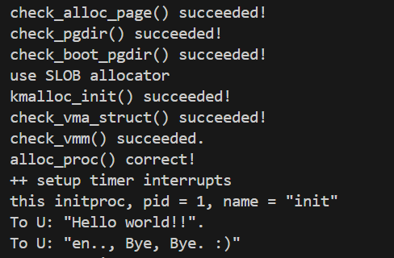

# Lab4实验报告
## （小组成员：2312289刘轩麟 2312114李子恒 2213468陈馨颍）
## 练习一：分配并初始化一个进程控制块
我们需要完成alloc\_proc()的编写，代码如下：
```c
static struct proc_struct *
alloc_proc(void)
{
    struct proc_struct *proc = kmalloc(sizeof(struct proc_struct));
    if (proc != NULL)
    {
        proc->state = 0;//初始值PROC_UNINIT
        proc->pid = -1; //先设置为无效
        proc->runs = 0;
        proc->kstack = 0;
        proc->need_resched = 0; //不用schedule调度其他进程
        proc->parent = NULL;
        proc->mm = NULL;
        memset(&proc->context, 0, sizeof(struct context));
        proc->tf = NULL;
        proc->pgdir = boot_pgdir_pa;
        proc->flags = 0;
        memset(proc->name, 0, sizeof(proc->name));
    }
    return proc;
}

```
首先我们使用**kmalloc** 分配一个 **proc\_struct**大小的内存，如果分配成功，我们依次初始化结构体中的属性：
1. state=0意为未初始化，对应的是枚举类型PROC_UNINIT
1. pid设为-1，意为进程状态无效
1. runs是进程被调度运行的次数
1. kstack是初始化内核栈地址，这里先把它初始化为0，后续会分配
1. need_resched标志是否需要调度其他进程，这里设为0，意为不需要立即调度
1. 父进程指针置为NULL
1. 内存管理指针mm置为NULL
1. 把上下文结构初始化为全0，context本质上是一些寄存器
1. tf是我们上次实验中的trapframe，这里也置为NULL
1. 页目录的物理地址设为boot_pgdir_pa, 在我们的代码中是0x80208000
1. 进程名称也分配内存，表示清空

### Question: 
struct context context：定义了一个名为context的**进程上下文**结构体，用于保存进程切换时需要保存和恢复的CPU寄存器状态。其成员变量分别是返回地址寄存器ra、栈指针寄存器sp和被调用者保存寄存器s0-s11.

struct trapframe *tf：定义了一个指向陷阱帧(trap frame)的指针，陷阱帧是当发生中断、异常或系统调用时，用于保存进程从用户态陷入内核态时的完整CPU状态的数据结构。其成员变量包括所有32个通用寄存器gpr和控制状态寄存器status、 epc、badvaddr、cause。

context在switch\_to函数中被使用，就是把进程的context的相关值保存倒内存里，等到再被调度的时候再恢复回去。至于说为什么只保存部分寄存器，一方面编译器会自动帮助我们生成保存和恢复调用者保存寄存器的代码，在实际的进程切换过程中我们只需要保存被调用者保存寄存器就可以；另一方面保存更少的寄存器也使得逻辑更精简、效率更高。

trapframe保存用户态程序的完整执行现场，进入内核时保存、退出内核时恢复。
## 练习二：为新创建的内核线程分配资源
创建一个内核线程需要分配和设置好很多资源。kernel_thread函数通过调用do_fork函数完成具体内核线程的创建工作。do_kernel函数会调用alloc_proc函数来分配并初始化一个进程控制块，但alloc_proc只是找到了一小块内存用以记录进程的必要信息，并没有实际分配这些资源。ucore一般通过do_fork实际创建新的内核线程。do_fork的作用是，创建当前内核线程的一个副本，它们的执行上下文、代码、数据都一样，但是存储位置不同。因此，我们实际需要"fork"的东西就是stack和trapframe。在这个过程中，需要给新内核线程分配资源，并且复制原进程的状态。do_fork()的代码如下:
```c
int do_fork(uint32_t clone_flags, uintptr_t stack, struct trapframe *tf)
{
    int ret = -E_NO_FREE_PROC;
    struct proc_struct *proc;
    if (nr_process >= MAX_PROCESS)
    {
        goto fork_out;
    }
    ret = -E_NO_MEM;

    proc = alloc_proc();
    if(proc == NULL)
    {
        goto fork_out;
    }
    if (setup_kstack(proc) != 0)
    {
        goto bad_fork_cleanup_proc;
    }
    if (copy_mm(clone_flags, proc) != 0)
    {
        goto bad_fork_cleanup_kstack;
    }
    copy_thread(proc,stack,tf);
    proc->parent = current;          // 父进程为当前进程
    proc->pid = get_pid();           // 分配唯一 PID
    hash_proc(proc);                 // 加入 PID 哈希表（加速查找）
    list_add(&proc_list, &proc->list_link);  // 加入全局进程链表
    nr_process++;
    wakeup_proc(proc);
    ret = proc->pid;
fork_out:
    return ret;

bad_fork_cleanup_kstack:
    put_kstack(proc);
bad_fork_cleanup_proc:
    kfree(proc);
    goto fork_out;
}
```
我们利用setup\_kstack分配内存栈，给新的进程分配了8KB的内核栈空间，如果失败，跳到bad_fork_cleanup_proc释放已分配的PCB；接着利用copy\_mm接口复制父进程的内存管理结构，如果失败，跳转到bad_fork_cleanup_kstack清理内核栈和PCB；然后我们想copy_thread中传入新进程的PCB、新进程的栈指针和trapframe，这其中的操作是调整了proc结构体中tf和context的内容。

然后依次是设置父子关系、利用get\_pid分配进程ID、加入进程哈希表、加入全局进程链表并且增加进程计数器、通过wakeup_proc唤醒进程（其实是调整进程的state）。最后返回新进程的id。

### Question：
ucore能做到给每个新fork的线程一个唯一的id。在do_fork中，进程id由get_pid()赋值。get_pid()里对于last_pid会进行检查，当其小于next_safe时可以保证不会冲突，大于时会自增的同时判断是否冲突，直到不冲突为止，再更新next_safe.这样可以保证进程id一定唯一。

从代码上看，函数维护两个静态变量 last_pid 和 next_safe。last_pid 记录上一次分配出去的 PID，每次分配时从这个值递增开始尝试；next_safe 标记了从 last_pid 开始向后数，下一个已被占用的 PID 位置，构成了一个"安全区间"。

当 last_pid 小于 next_safe 时，说明在这个区间内没有 PID 冲突，可以直接递增分配，无需扫描进程列表，效率很高。但当 last_pid 到达或超过 next_safe 时，函数会遍历全局进程链表 proc_list，检查当前的 last_pid 是否已被占用。如果发现冲突，就继续递增 last_pid 并重新检查；如果没有冲突，就在扫描过程中更新 next_safe 为下一个已占用的 PID，重新确定安全区间的边界。

当 PID 达到上限 MAX_PID 时，函数会将 last_pid 回绕到 1（0 预留给 idle 进程），然后重新扫描整个进程列表，找到第一个可用的 PID。这样就保证了 PID 的唯一性。
## 练习三：编写proc_run 函数
proc_run用于将指定的进程切换到CPU上运行，代码如下：
```c
void proc_run(struct proc_struct *proc)
{
    if (proc != current)
    {
         bool intr_flag;
        local_intr_save(intr_flag);
        struct proc_struct *prev = current;
        current = proc;
        lsatp(proc->pgdir);
        switch_to(&prev->context,&current->context);
        local_intr_restore(intr_flag);
    }
}
```
其实现思路如下：
1. 检查要切换的进程是否与当前正在运行的进程相同，如果相同则不需要切换。
2. 禁用中断。使用/kern/sync/sync.h中定义好的宏local_intr_save(x)来禁用中断
3. 切换当前进程为要运行的进程（current）
4. 切换页表，以便使用新进程的地址空间。使用lsatp(unsigned int pgdir)函数，可修改SATP寄存器值。
5. 实现上下文切换。我们调用switch_to()函数，可实现两个进程的context切换。
6. 允许中断。使用/kern/sync/sync.h中定义好的宏local_intr_store(x)来允许中断

我们使用make qemu命令运行程序，获得以下结果：


可以看出，第 1 个真正的内核线程 initproc成功创建，并通过schedule()选择可运行的线程并进行线程切换，从而让initproc获得 CPU 执行权并输出 “Hello World” 

### Question：
本实验的执行过程中，创建且运行了两个内核线程：第一个是idleproc，由内核使用 bootstack 启动；第二个是init_main。
## 扩展练习Challenge
##### 1、说明语句local_intr_save(intr_flag);....local_intr_restore(intr_flag);是如何实现开关中断的？
我们直接查看位于/kern/sync/sync.h有关这两个宏的定义：
```c
static inline bool __intr_save(void) {
    if (read_csr(sstatus) & SSTATUS_SIE) {
        intr_disable();
        return 1;
    }
    return 0;
}

static inline void __intr_restore(bool flag) {
    if (flag) {
        intr_enable();
    }
}

#define local_intr_save(x) \
    do {                   \
        x = __intr_save(); \
    } while (0)
#define local_intr_restore(x) __intr_restore(x);
```
可以观察到local_intr_save(x)和local_intr_restore(x)分别调用__intr_save(void)与__intr_restore(bool flag)来完成核心功能。我们可以先分析__intr_save(void)是如何关闭中断使能的：

经过Lab3的学习，我们知道在 RISC-V 架构中，每个硬件线程（Hart）都拥有独立的 SIE 寄存器，SIE寄存器是控制中断使能的核心寄存器。我们可以先将intr_disable看作“清除SIE”的黑盒函数，那么__intr_save函数的执行逻辑将很清晰————先判断sstatus中SIE的状态是如何的，若为1，则表示当前可以中断，因此我们要将SIE清除，也就是**禁用中断**，并返回true；若为0，那么表示就是不可中断的情况，因此无需处理，并返回false，**返回值**表示在执行__intr_save(void)之前SIE的情况。而我们看到在local_intr_save(x)中将传入的x变量设置为了**该返回值**，因此这个变量将承担在local_intr_save(x)和local_intr_restore(x)之间传递原SIE状态的重要作用。

那么对于__intr_save(bool flag)来说，他首先接收标志着“禁用中断”前SIE状态的变量x（这里和上面的变量x对应，实验中的实例变量名为__intr_flag），后续的处理也很简单，如果x为true，那就调用__intr_enable（同样，我们也将其看作给寄存器置位的黑盒函数）将SIE置位；如果x为false，那很开心我们什么都不用做，因为SIE自始至终都没有变过。

最后我们再来看一下前面我们看作黑盒函数的intr_disable与intr_enable，其定义在/kern/driver/intr.c中,逻辑也很简单，调用riscv.h提供的CSR操作宏，用于给CSR置位或清除。
```c
#include <intr.h>
#include <riscv.h>

/* intr_enable - enable irq interrupt */
void intr_enable(void) { set_csr(sstatus, SSTATUS_SIE); }

/* intr_disable - disable irq interrupt */
void intr_disable(void) { clear_csr(sstatus, SSTATUS_SIE); }
```

##### 2、深入理解不同分页模式的工作原理
###### get_pte()函数中有两段形式类似的代码， 结合sv32，sv39，sv48的异同，解释这两段代码为什么如此相像。
```c
pte_t *get_pte(pde_t *pgdir, uintptr_t la, bool create)
{
    //第一段
    pde_t *pdep1 = &pgdir[PDX1(la)];
    if (!(*pdep1 & PTE_V))
    {
        struct Page *page;
        if (!create || (page = alloc_page()) == NULL)
        {
            return NULL;
        }
        set_page_ref(page, 1);
        uintptr_t pa = page2pa(page);
        memset(KADDR(pa), 0, PGSIZE);
        *pdep1 = pte_create(page2ppn(page), PTE_U | PTE_V);
    }
    //第二段
    pde_t *pdep0 = &((pte_t *)KADDR(PDE_ADDR(*pdep1)))[PDX0(la)];
    if (!(*pdep0 & PTE_V))
    {
        struct Page *page;
        if (!create || (page = alloc_page()) == NULL)
        {
            return NULL;
        }
        set_page_ref(page, 1);
        uintptr_t pa = page2pa(page);
        memset(KADDR(pa), 0, PGSIZE);
        *pdep0 = pte_create(page2ppn(page), PTE_U | PTE_V);
    }
    return &((pte_t *)KADDR(PDE_ADDR(*pdep0)))[PTX(la)];
}
```
上面的get_pte函数中相似的两段代码的功能为：
1. 都检查某级页表项是否存在
2. 若不存在则分配一页作为该级页表
3. 清空
4. 填入 PTE 

为我们首先要明确的是，这两段代码处理的对象不同，分别处理了一级页目录和二级页目录。但由于无论是sv32、sv39还是sv48，不同级页目录的结构总是相似的，而riscv对于多级页表的访问都遵循同一递归结构，因此处理他们的代码也是相似的。
| RISC-V 模式 | 层级数 | 每层页表大小 | 每层索引大小  | 每项内容                  |
| --------- | --- | ------ | ------- | --------------------- |
| Sv32      | 2 层 | 4KB    | 10 bits | 下一级页表的物理页号 / 映射页的物理页号 |
| Sv39      | 3 层 | 4KB    | 9 bits  | 同上                    |
| Sv48      | 4 层 | 4KB    | 9 bits  | 同上                    |

###### 目前get_pte()函数将页表项的查找和页表项的分配合并在一个函数里，你认为这种写法好吗？有没有必要把两个功能拆开？
先说观点，我认为这种写法至少在目前来看是有好处的，同时没有必要把查找和分配拆开。

首先，我们来分析一下查找和分配各自的流程就知道，他们都要逐级处理页表，因此将两个功能合并在一起可以减少代码冗余。其次我们考虑把他们拆开来，那么对于页表项的分配来说，我们想要分配首先得确认分配的“必要性”，也就是说需要**调用查找函数**来看一看当前是否已经分配了页表项，所以拆开这两个功能没有啥意义；而对于我们只想进行查找操作而不进行分配的情况，我们的get_pte函数提供了一个**参数creat**来控制是否在不存在对应页表项时进行分配，所以我们只需要根据需求调整creat的值就行了。