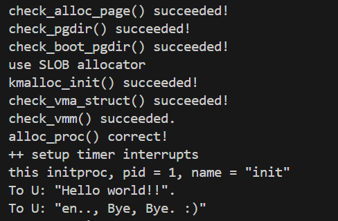

# Lab4实验报告
## （小组成员：2312289刘轩麟 2312114李子恒 2213468陈馨颍）
## 练习一：分配并初始化一个进程控制块
我们需要完成alloc\_proc()的编写，代码如下：
```c
static struct proc_struct *
alloc_proc(void)
{
    struct proc_struct *proc = kmalloc(sizeof(struct proc_struct));
    if (proc != NULL)
    {
        proc->state = 0;//初始值PROC_UNINIT
        proc->pid = -1; //先设置为无效
        proc->runs = 0;
        proc->kstack = 0;
        proc->need_resched = 0; //不用schedule调度其他进程
        proc->parent = NULL;
        proc->mm = NULL;
        memset(&proc->context, 0, sizeof(struct context));
        proc->tf = NULL;
        proc->pgdir = boot_pgdir_pa;
        proc->flags = 0;
        memset(proc->name, 0, sizeof(proc->name));
    }
    return proc;
}

```
首先我们使用**kmalloc** 分配一个 **proc\_struct**大小的内存，如果分配成功，我们依次初始化结构体中的属性：
1. state=0意为未初始化，对应的是枚举类型PROC_UNINIT
1. pid设为-1，意为进程状态无效
1. runs是进程被调度运行的次数
1. kstack是初始化内核栈地址，这里先把它初始化为0，后续会分配
1. need_resched标志是否需要调度其他进程，这里设为0，意为不需要立即调度
1. 父进程指针置为NULL
1. 内存管理指针mm置为NULL
1. 把上下文结构初始化为全0，context本质上是一些寄存器
1. tf是我们上次实验中的trapframe，这里也置为NULL
1. 页目录的物理地址设为boot_pgdir_pa, 在我们的代码中是0x80208000
1. 进程名称也分配内存，表示清空
## 练习二：为新创建的内核线程分配资源
创建一个内核线程需要分配和设置好很多资源。kernel_thread函数通过调用do_fork函数完成具体内核线程的创建工作。do_kernel函数会调用alloc_proc函数来分配并初始化一个进程控制块，但alloc_proc只是找到了一小块内存用以记录进程的必要信息，并没有实际分配这些资源。ucore一般通过do_fork实际创建新的内核线程。do_fork的作用是，创建当前内核线程的一个副本，它们的执行上下文、代码、数据都一样，但是存储位置不同。因此，我们实际需要"fork"的东西就是stack和trapframe。在这个过程中，需要给新内核线程分配资源，并且复制原进程的状态。do_fork()的代码如下:
```c
int do_fork(uint32_t clone_flags, uintptr_t stack, struct trapframe *tf)
{
    int ret = -E_NO_FREE_PROC;
    struct proc_struct *proc;
    if (nr_process >= MAX_PROCESS)
    {
        goto fork_out;
    }
    ret = -E_NO_MEM;

    proc = alloc_proc();
    if(proc == NULL)
    {
        goto fork_out;
    }
    if (setup_kstack(proc) != 0)
    {
        goto bad_fork_cleanup_proc;
    }
    if (copy_mm(clone_flags, proc) != 0)
    {
        goto bad_fork_cleanup_kstack;
    }
    copy_thread(proc,stack,tf);
    proc->parent = current;          // 父进程为当前进程
    proc->pid = get_pid();           // 分配唯一 PID
    hash_proc(proc);                 // 加入 PID 哈希表（加速查找）
    list_add(&proc_list, &proc->list_link);  // 加入全局进程链表
    nr_process++;
    wakeup_proc(proc);
    ret = proc->pid;
fork_out:
    return ret;

bad_fork_cleanup_kstack:
    put_kstack(proc);
bad_fork_cleanup_proc:
    kfree(proc);
    goto fork_out;
}
```
我们利用setup\_kstack分配内存栈，给新的进程分配了8KB的内核栈空间，如果失败，跳到bad_fork_cleanup_proc释放已分配的PCB；接着利用copy\_mm接口复制父进程的内存管理结构，如果失败，跳转到bad_fork_cleanup_kstack清理内核栈和PCB；然后我们想copy_thread中传入新进程的PCB、新进程的栈指针和trapframe，这其中的操作是调整了proc结构体中tf和context的内容。

然后依次是设置父子关系、利用get\_pid分配进程ID、加入进程哈希表、加入全局进程链表并且增加进程计数器、通过wakeup_proc唤醒进程（其实是调整进程的state）。最后返回新进程的id。

## 练习三：编写proc_run 函数
proc_run用于将指定的进程切换到CPU上运行，代码如下：
```c
void proc_run(struct proc_struct *proc)
{
    if (proc != current)
    {
         bool intr_flag;
        local_intr_save(intr_flag);
        struct proc_struct *prev = current;
        current = proc;
        lsatp(proc->pgdir);
        switch_to(&prev->context,&current->context);
        local_intr_restore(intr_flag);
    }
}
```
其实现思路如下：
1. 检查要切换的进程是否与当前正在运行的进程相同，如果相同则不需要切换。
2. 禁用中断。使用/kern/sync/sync.h中定义好的宏local_intr_save(x)来禁用中断
3. 切换当前进程为要运行的进程（current）
4. 切换页表，以便使用新进程的地址空间。使用lsatp(unsigned int pgdir)函数，可修改SATP寄存器值。
5. 实现上下文切换。我们调用switch_to()函数，可实现两个进程的context切换。
6. 允许中断。使用/kern/sync/sync.h中定义好的宏local_intr_store(x)来允许中断

我们使用make qemu命令运行程序，获得以下结果：


可以看出，第 1 个真正的内核线程 initproc成功创建，并通过schedule()选择可运行的线程并进行线程切换，从而让initproc获得 CPU 执行权并输出 “Hello World” 
## 扩展联系Challenge