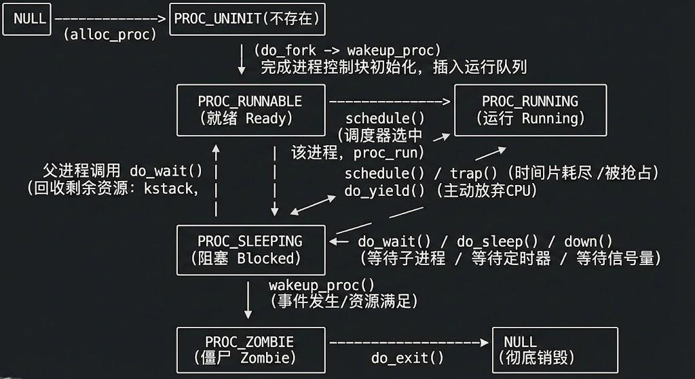

# Lab5：用户进程管理
## （小组成员：2312289刘轩麟 2312114李子恒 2213468陈馨颍）
## 练习0：把之前的代码填充到项目里
我们在lab4中我们使用do_fork复制出一个新进程，我们需要做的改动有两处：
1. 设置当前进程为父进程，确保当前进程的 wait_state 为 0
1. 设置进程关系链接，这一步我们直接调用set_link，这其中把子进程插入到父进程的子链表以及全局进程链表
代码如下：
```c
    proc->parent = current;          // 父进程为当前进程
    current->wait_state = 0; // 确保当前进程的 wait_state 为 0
    ...
    set_links(proc); // 设置进程关系链接，并加入全局进程链表
```

另外，我们还要修改trap.c中时间片轮转的逻辑，否则会出错：
```c
    case IRQ_S_TIMER:
         clock_set_next_event();
            ticks++;
            if(ticks%TICK_NUM==0)
            {   
                if(current!=NULL)
                {
                    current->need_resched = 1;
                }
            }
        break;
```
每 TICK_NUM 次中断（如 100 次），进行判断当前是否有进程正在运行，如果有则标记该进程需要被重新调度。
## 练习1: 加载应用程序并执行（需要编码）
do_execv函数调用load_icode来加载并解析一个处于内存中的ELF执行文件格式的应用程序，我们需要在load_icode里补充部分代码。首先我们看一下这个函数做了什么：
1. 创建新的 mm 结构体和页目录表（PDT），进行内存结构初始化
1. 检查ELF是否合法
1. 遍历 ELF 可加载段，创建虚拟内存区域（vma），分配物理页，复制 TEXT/DATA 段内容，将 BSS 段初始化为 0
1. 为用户栈分配虚拟内存空间，并预分配 4 个物理页
1. 绑定当前进程的 mm、页目录物理地址，更新 satp 寄存器
1. 设置好proc_struct结构中的成员变量trapframe中的内容

可以看到，代码中需要我们补充的就是trapframe中寄存器的状态维护，我们需要分别维护**用户进程的栈指针sp**、**epc寄存器**和**status寄存器**。
1. 设置sp为用户栈的顶部地址，我们直接用memlayout.h中定义的宏**USTACKTOP**实现。用户栈是进程运行时用于存储局部变量、函数调用信息等的内存区域
1. 设置用户态进程的程序计数器（epc）为ELF文件的入口点地址**elf->e_entry**，这时用户进程的起始执行地址
1. 状态寄存器的设置需要用到原本保存的状态寄存器的值sstatus，我们要保留其基础的状态，仅对个别位进行调整，我们首先对~SSTATUS_SPP进行与操作，意思是对**SPP**那一位清零，其他位保存。因为SPP 位用于标识**上一次的特权级别**，1 表示上一级是内核态，0 表示上一级是用户态，清除该位后，CPU 从内核态返回时会进入用户态；接着我们对**SSTATUS_SPIE**进行或操作，意思是把SPIE那一位置1，SPIE 位用于控制**返回后是否开启中断**，1 表示恢复到用户态后允许响应中断，0 则禁用，所以我们希望用户态程序运行时能正常处理中断。

代码如下：
```c
    tf->gpr.sp = USTACKTOP;
    tf->epc = elf->e_entry;
    tf->status = (sstatus & ~SSTATUS_SPP) | SSTATUS_SPIE;
    ret = 0;
```

### 问题：请简要描述这个用户态进程被ucore选择占用CPU执行（RUNNING态）到具体执行应用程序第一条指令的整个经过。
用户进程被设为RUNNABLE是在do_fork中的wakeup操作进行的，也就是说，此时我们已经创建好了user_main用户进程。不要忘了，我们此时处在init_main内核进程的执行过程中，所以init进程为父进程，用do_wait来控制调度：
```c
    while (do_wait(0, NULL) == 0) 
    {
        schedule();
    }

```
简单来说，触发调度的情况有两种：
1. 在do_wait函数里，没有找到为僵尸状态的子进程，那么直接触发调度
1. 只要还能成功回收一个子进程（僵尸状态），就继续循环触发调度;
既然触发调度了，那执行过程就和lab4很像了，依次经过proc_run->switch_to->forkret->__trapret，最后通过sret跳到epc(kernel_thread_entry)，里面通过汇编连接到了目标进程（user_main），这时才算运行起来了user_main。
这里面需要编译好的用户程序，分别传入名称、内存起始地址和大小，送进了kernel_execve（先经过了几个宏的封装）。kernel_execve中使用了内联汇编：
```c
    asm volatile(
        "li a0, %1\n"
        "lw a1, %2\n"
        "lw a2, %3\n"
        "lw a3, %4\n"
        "lw a4, %5\n"
        "li a7, 10\n"
        "ebreak\n"
        "sw a0, %0\n"
        : "=m"(ret)
        : "i"(SYS_exec), "m"(name), "m"(len), "m"(binary), "m"(size)
        : "memory");
```
前面几个寄存器分别赋值为SYS_exec、name……，为了在异常处理中给syscall提供参数。把a7强制赋为10，为了在异常处理程序中进行特判。Ebreak之后，就进入trap.c中的断点特定处理中：
```c
    case CAUSE_BREAKPOINT:
        cprintf("Breakpoint\n");
        if (tf->gpr.a7 == 10)
        {
            tf->epc += 4;
            syscall();
            kernel_execve_ret(tf, current->kstack + KSTACKSIZE);
        }
        break;
```
先用a7做了特判，通过设置a7寄存器的值为10说明这不是一个普通的断点中断，而是要转发到syscall()，这样就可以在S态实现系统调用。syscall的实现在syscall/syscall.c中，是根据a1寄存器（系统调用号）转发到不同的系统调用封装，比如SYS_exec=4转发到sys_exec，这里面return了do_execve。
do_execve里面把新的程序加载到当前进程里的工作都在load_icode()函数里完成，我们在补充代码时简要介绍过这里做了什么，我们补充的那部分代码尤其关键，sp设置了用户态栈、epc设置了elf->entry也就是真正的用户代码入口、SPP清零让程序返回用户态，这些trapframe的变量通过kernel_execve_ret放到内核栈上，接着通过__trapret存到对应寄存器当中，这时已经具备执行用户程序的条件了，只需sret，直接跳到epc存的地址（elf->entry），终于到了用户程序的入口，并且由于SPP=0，sret之后是用户态。
## 练习2：父进程复制自己的内存空间给子进程（需要编码）
创建子进程的函数do_fork在执行中将拷贝当前进程（即父进程）的用户内存地址空间中的合法内容到新进程
中（子进程），完成内存资源的复制。具体是通过copy_range函数实现的，在这个函数中，已经找到源页对应的物理页page，并为目标进程分配新的物理页npage。接下来需要我们做的就是将源物理页的虚拟地址内容，完整拷贝到目标物理页的虚拟地址，这就需要我们用page2kva来实现物理地址到虚拟地址的转换。在拷贝完成之后，还需要将目标物理页与目标进程的线性地址建立映射，我们使用page_insert实现。代码如下：
```c
        void *src_kvaddr = page2kva(page); // 获取源页面的内核虚拟地址
        void *dst_kvaddr = page2kva(npage); // 获取目标页面的内核虚拟地址
        memcpy(dst_kvaddr, src_kvaddr, PGSIZE); // 复制页面内容
                
        int ret = page_insert(to, npage, start, perm); // 将目标页面插入到目标进程的页表中
```

关于COW机制，我们在Challenge部分进行实现和讨论。

## 练习3：阅读分析源代码，理解进程执行 fork/exec/wait/exit 的实现，以及系统调用的实现（不需要编码）
接下来我们分析fork/exec/wait/exit的执行流程。总的来说，这些函数在用户程序中被调用，因此在用户进程需要为函数的调用准备参数，发起调用请求。具体调用的就是do_*()函数。
1. fork：
如果用户调用fork()，定义在用户态ulib文件中的fork()会调用sys_fork()，而用户态sys_fork是库函数的封装，会通过ecall发起系统调用：返回 syscall(SYS_fork())。至此进程就**从用户级升级到了内核级**，后面再查表 dispatch，SYS_fork()会调用内核的sys_fork(arg)函数，该函数在内核的syscall目录的syscall.c文件定义，它把父进程的trapframe和当前的用户栈指针拿过来，传给do_fork()。do_fork()才真正调用一系列内核级工具来实现进程的复制。
do_fork 先分配并初始化子进程的内核结构、复制/共享父进程的内存、把父的寄存器上下文复制给子（并把子的 a0寄存器 设为 0），然后把子插入进程表并标记为可运行；父进程立即得到子 PID，子进程在后续被调度时返回 0。

2. execv：
在指导手册中我们学习了第一个用户进程的创建，正是调用了方法execv。该方法目前只在内核中使用。所以在用户态库中没有封装。本次实验中，user_main调用了kernel_execev将我们编写的exit程序代替user_main继续执行。我们在kernel_execev函数中使用ebreak来模拟中断，以此来确保进程的上下文与状态可以顺利切换。他就像一个用户态程序一样，通过syscall查表调用do_execve，但本质上CPU状态级一致没有切换。sys_exec(arg) 从 arg[] 取出四个参数（程序名指针、名字长度、binary 指针、binary 大小），直接调用内核实现 do_execve(name,len,binary,size) 去做真正的加载/替换用户空间工作。
do_execev就是把当前进程的用户空间完全拆掉，按 ELF 给它穿上一个全新的用户空间和栈，然后把寄存器（epc/sp/status）设置好，最后从新程序入口继续运行——进程身份（PID 等）不变，但运行的程序彻底变成新的 ELF。如果执行成功那么execev不会返回，失败才会返回。

3. wait：
wait的封装思路基本和fork类似。例如在exit.c中我们调用wait()，wait()将调用用户态的sys_wait()，通过ecall发起系统调用，触发一个中断。此时切换为内核级进行操作，在syscall中进行查表找到内核级的sys__wait函数，它会解析子进程pid和退出码，然后传给do_wait。
do_wait 就是父进程去看它的孩子们有没有“变成僵尸”——有的话就把子进程的**退出码读出来**，把子进程的内核资源彻底收回；没有的话，要么直接报没有子进程的错误，要么把自己sleep，等孩子退出，再回来处理。

4. exit：
同样在exit.c中我们调用了exit()，后续和前面的调用流程一样，不再赘述，直到内核级的sys_wait函数，它把退出错误码传给do_exit。
do_exit 就是把进程从“活着”变成“僵尸”并把该做的清理工作做好（回收用户内存、保存退出码、把子女交给 init、唤醒父进程），然后让出 CPU 给别人，等待父进程来彻底回收它的内核资源。
ucore中一个用户态进程的执行状态生命周期图如下：



## Challenge:
### 1. 实现COW机制
我们发现，copy_range留了一个形参shre没有使用，这个就是COW机制的开关，copy_range在fork调用时被用到，调用的路径是：
do_fork->copy_mm->lock_mm->dup_mmap->copy_range(share=1)
我们在这里就不做拷贝了，而是把物理页面分别映射到子进程空间和父进程空间，其实就是调用了两次page_insert。需要注意的是，写权限要置零，也就是说当前父子进程对页面只有读权限，这为我们后续捕获缺页异常提供了条件。代码如下：
```c
        if (share) {
                // COW逻辑：共享物理页，设为只读
                struct Page *page = pte2page(*ptep);
                assert(page != NULL);
                int ret = page_insert(to, page, start, perm & (~PTE_W));
                if (ret != 0) {
                    return ret;
                }
                ret = page_insert(from, page, start, perm & (~PTE_W));
                if (ret != 0) {
                    return ret;
                }
            }
```
一旦有进程写该物理页，那么就会触发**CAUSE_STORE_PAGE_FAULT**，所以我们要在异常处理函数中处理写缺页异常。设计思路如下：
1. 校验页表项，比如验证页表项为只读属性
1. 校验地址合法性，验证触发写错误的地址（tf->tval）在合法的虚拟内存空间内。首先验证VMA存在，并确定这块空间可写
1. 获取物理页面和页表项
1. 如果该页的引用计数仅为1，那么说明这个页被独占，那么重新建立当前进程与物理页的映射，并把权限设为可写。
1. 如果引用计数大于1，那么该页面被共享。我们的做法是alloc出一个新页，把旧页拷贝到新页。但建立当前进程与新页的映射，并设置权限可写。
代码如下：
```c
    case CAUSE_STORE_PAGE_FAULT:
        if (1) {
            uintptr_t addr = tf->tval;  // 获取触发异常的地址
            struct mm_struct *mm = current->mm;
            pte_t *ptep;
            
            // 检查是否是COW场景
            ptep = get_pte(mm->pgdir, addr, 0);
            if (ptep && (*ptep & PTE_V) && !(*ptep & PTE_W)) {
                struct vma_struct *vma = find_vma(mm, addr);
                if (vma && (vma->vm_flags & VM_WRITE)) {
                    struct Page *page = pte2page(*ptep);
                    uint32_t perm = (*ptep & PTE_USER);
                    
                    // 如果引用计数为1，直接设为可写
                    if (page_ref(page) == 1) {
                        page_insert(mm->pgdir, page, addr, perm | PTE_W);
                    } else {
                        // 引用计数>1，需要复制页面
                        struct Page *npage = alloc_page();
                        if (npage == NULL) {
                            panic("COW: out of memory");
                        }
                        memcpy(page2kva(npage), page2kva(page), PGSIZE);
                        if (page_insert(mm->pgdir, npage, addr, perm | PTE_W) != 0) {
                            panic("COW: page_insert failed");
                        }
                    }
                    break;
                }
            }
            // 非COW场景，打印错误信息
            cprintf("Store fault at %p (epc: %p)\n", tf->tval, tf->epc);
            print_trapframe(tf);
            panic("handle pgfault failed");
        }
        break;
```
测试时，我们只需把share变量设为1，就可以启用COW机制。在框架提供的用户程序中，有几个程序比如forktest、spin、exit、badarg等会使用fork，那么就用到了刚实现的COW机制。这其中难免会有对栈的写操作等等，所以会触发缺页异常，这样就测试了共享机制+缺页异常处理的COW实现。
我们可以简单描述一下COW机制的状态机：
1. 独占可写（ref=1，PTE_W=1）经过fork后变成共享只读（ref>1，PTE_W=0）
1. 共享只读（ref>1，PTE_W=0）遇到写缺页的情况，原页仍为共享只读（ref>1，PTE_W=0），新页独占可写（ref=1，PTE_W=1）
1. 共享只读（ref>1，PTE_W=0）遇到page_remove，仍为共享只读，直到ref = 0，变成无映射状态
1. 独占可写（ref=1，PTE_W=1）遇到page_remove，直接变成无映射状态
### 2.说明该用户程序是何时被预先加载到内存中的？与我们常用操作系统的加载有何区别，原因是什么？
加载的过程在load_icode函数中完成，其中解析了用户程序ELF格式的二进制image，并且便利了TEXT、DATA、BSS段，并对每个段进行了虚拟地址映射，分配物理页并直接用memcpy拷贝到物理页上。然后提前分配 4 个物理页作为用户栈，而非等待栈访问时再分配。
而常用的操作系统如Linux、Windows等，进程启动时仅创建虚拟地址映射，不分配物理页；仅当进程访问某虚拟页触发缺页异常时，才分配物理页并加载数据，也就是按需分配。
造成这样的原因是ucore希望简化设计，突出关键的理念即可。更重要的是，ucore仅运行少量用户进程，物理内存充足，无需通过按需分页节省内存；而常用 OS 需支持多进程并发，必须通过按需分页避免物理内存被闲置页占满；而且ucore未实现页缓存和文件映射，无法支撑按需分页的 “缺页->读文件” 逻辑，因此只能提前拷贝所有数据.

